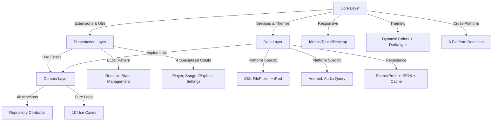

# Clean Architecture en Sonofy

## 📐 Visión General

Sonofy implementa una **Clean Architecture** avanzada basada en los principios de Robert C. Martin, optimizada específicamente para aplicaciones musicales multiplataforma. La arquitectura se caracteriza por su enfoque híbrido que adapta comportamientos según la plataforma (iOS/Android) mientras mantiene una separación clara de responsabilidades y dependencias unidireccionales hacia el núcleo de dominio.

## 🏗️ Estructura de Capas

### 1. Presentation Layer (Capa de Presentación)
**Ubicación**: `lib/presentation/`

Capa reactiva con gestión de estado sofisticada y componentes especializados:

```dart
presentation/
├── blocs/           # Gestión de estado con BLoC/Cubit pattern
│   ├── player/      # Reproductor con dual-playlist management
│   ├── playlists/   # Gestión CRUD de playlists con persistencia
│   ├── settings/    # Configuraciones con temas dinámicos
│   └── songs/       # Biblioteca con carga progresiva cross-platform
├── screens/         # Pantallas principales con navegación avanzada
│   ├── library_screen.dart     # Biblioteca con búsqueda interactiva
│   ├── player_screen.dart      # Reproductor inmersivo con Hero animations
│   ├── playlist_screen.dart    # Visualización de playlists individuales
│   ├── reorder_playlist_screen.dart  # Reordenamiento drag & drop
│   ├── settings_screen.dart    # Configuraciones modulares
│   └── splash_screen.dart      # Onboarding con inicialización
├── views/           # Vistas modulares y especializadas
│   ├── modal_view.dart         # Sistema modal unificado
│   └── settings/               # Secciones de configuración
│       ├── appearance_section.dart   # Temas y colores dinámicos
│       ├── color_picker_dialog.dart  # Selector de color primario
│       ├── language_section.dart     # Internacionalización
│       ├── local_music_section.dart  # Gestión música local (iOS)
│       └── security_section.dart     # Autenticación biométrica
└── widgets/         # Widgets especializados por contexto
    ├── common/      # Componentes base reutilizables
    ├── library/     # Widgets biblioteca (cards, grids, player mini)
    ├── options/     # Sistema contextual de opciones/menús
    └── player/      # Controles avanzados de reproducción
```

**Responsabilidades Avanzadas**:
- **Gestión de Estado Reactiva**: 4 Cubits especializados con estados inmutables
- **Sistema de Reproducción Dual**: Playlist original + shuffle playlist separadas
- **Carga Progresiva**: Streams de datos con feedback visual en tiempo real  
- **UI Responsiva**: Adaptación automática móvil/tablet/desktop
- **Navegación Declarativa**: GoRouter con transiciones personalizadas
- **Temas Dinámicos**: Colores primarios configurables por usuario
- **Sistema Modal Contextual**: Opciones diferenciadas por contexto (biblioteca/playlist/reproductor)
- **Componentes Especializados**: Widgets musicales con lógica de negocio integrada

**Dependencias**: Solo depende de la capa de dominio a través de repositorios abstractos.

### 2. Domain Layer (Capa de Dominio)
**Ubicación**: `lib/domain/`

Núcleo de la arquitectura con lógica de negocio pura y contratos estables:

```dart
domain/
├── repositories/    # Interfaces/Contratos abstractos
│   ├── player_repository.dart      # Reproductor con ecualizador futuro
│   ├── playlist_repository.dart    # CRUD + operaciones avanzadas
│   ├── settings_repository.dart    # Configuración y persistencia
│   └── songs_repository.dart       # Música multi-plataforma
└── usecases/       # Casos de uso especializados (10 total)
    ├── get_local_songs_usecase.dart       # Carga síncrona + Stream
    ├── get_songs_from_folder_usecase.dart # Escaneo carpetas (iOS)
    ├── select_music_folder_usecase.dart   # FilePicker integration (iOS)
    ├── create_playlist_usecase.dart       # Validación + persistencia
    ├── delete_playlist_usecase.dart       # Eliminación con validación
    ├── get_all_playlists_usecase.dart     # Deserialización JSON
    ├── update_playlist_usecase.dart       # Actualizaciones atómicas
    ├── add_song_to_playlist_usecase.dart  # Prevención duplicados
    ├── remove_song_from_playlist_usecase.dart  # Eliminación segura
    └── reorder_songs_in_playlist_usecase.dart   # Reordenamiento con timestamps
```

**Responsabilidades del Dominio**:
- **Contratos Estables**: Interfaces que definen comportamientos sin implementación
- **Lógica de Negocio Pura**: Casos de uso independientes de frameworks
- **Validaciones de Dominio**: Reglas de negocio (duplicados, límites, consistencia)
- **Coordinación Multi-Repositorio**: Casos de uso que orquestan múltiples fuentes
- **Abstracción Cross-Platform**: Contratos que ocultan diferencias de plataforma

**Dependencias**: No depende de ninguna otra capa (núcleo de la arquitectura).

### 3. Data Layer (Capa de Datos)
**Ubicación**: `lib/data/`

Implementaciones concretas con integración nativa y persistencia avanzada:

```dart
data/
├── models/          # Modelos de dominio con lógica de negocio
│   ├── player_preferences.dart    # Persistencia preferencias reproductor
│   ├── playlist.dart              # Modelo rico con métodos de negocio
│   └── setting.dart               # Configuración completa con validaciones
└── repositories/    # Implementaciones con integración nativa
    ├── player_repository_impl.dart        # Dual: AudioPlayer + iPod nativo
    ├── playlist_repository_impl.dart      # JSON + SharedPreferences
    ├── settings_repository_impl.dart      # Configuración con migraciones
    └── songs_repository_impl.dart         # Multi-platform: iOS/Android diferenciado
```

**Responsabilidades de Datos**:
- **Implementación Diferenciada**: Comportamiento específico iOS vs Android
- **Persistencia Híbrida**: SharedPreferences + archivos locales + bibliotecas nativas
- **Integración Nativa**: MethodChannel para reproductor iPod, FilePicker, permisos
- **Serialización/Deserialización**: JSON con migraciones y validaciones
- **Caché Inteligente**: Metadatos de audio con estimaciones y extracción real
- **Manejo de Errores**: Exception handling con mensajes descriptivos

**Dependencias**: Depende de la capa de dominio para implementar contratos.

### 4. Core Layer (Capa de Núcleo)
**Ubicación**: `lib/core/`

Infraestructura avanzada con sistemas especializados para aplicaciones musicales:

```dart
core/
├── constants/       # Sistema de breakpoints responsive
│   └── app_constants.dart       # Mobile/Tablet/Web con espaciado escalonado
├── enums/          # Enumeraciones con lógica de negocio integrada
│   ├── language.dart            # Localización dinámica con banderas
│   └── order_by.dart            # Ordenamiento con Strategy pattern
├── extensions/     # Extensiones reactivas y responsivas
│   ├── color_extensions.dart    # Colores adaptativos + gradientes musicales
│   ├── icon_extensions.dart     # Iconos responsivos con BLoC integration
│   ├── responsive_extensions.dart # Detección dispositivo + valores adaptativos
│   └── theme_extensions.dart    # Escalado fuentes + configuraciones
├── routes/         # Navegación declarativa avanzada
│   └── app_routes.dart          # GoRouter con transiciones especializadas
├── services/       # Servicios globales singleton
│   └── preferences.dart         # Persistencia con limpieza inteligente
├── themes/         # Sistema temático completo
│   ├── app_colors.dart          # Colores contextuales adaptativos
│   ├── gradient_helpers.dart    # Widgets gradiente especializados
│   ├── main_theme.dart          # Temas dinámicos con Material 3
│   ├── music_colors.dart        # Paleta musical con 16 colores
│   ├── music_theme.dart         # Temas especializados por contexto
│   └── neutral_theme.dart       # Colores optimizados tema oscuro
├── transitions/    # Transiciones cinematográficas
│   └── player_transition.dart   # Transición slide+fade optimizada
└── utils/          # Utilidades avanzadas multiplataforma
    ├── card_width.dart          # Cálculo responsive de anchos
    ├── device_platform.dart     # Detección 6 plataformas
    ├── duration_minutes.dart    # Formateo temporal MM:SS
    ├── ipod_library_converter.dart # Integración reproductor nativo iOS
    ├── mp3_file_converter.dart  # Conversor multi-formato con caché
    ├── page_transition.dart     # 6 tipos transiciones personalizadas
    ├── responsive_layout.dart   # Sistema completo diseño responsive
    ├── toast.dart              # Notificaciones con navegación global
    └── validators.dart         # Validación con 90+ dominios imágenes
```

## 🔄 Flujo de Dependencias Avanzado



## 🎧 Ejemplo Práctico: Sistema de Reproducción Dual con Shuffle Inteligente

### 1. Arquitectura del PlayerCubit (Presentation Layer)

El sistema de reproducción implementa una lógica sofisticada con dos playlists separadas:

```dart
// PlayerState - Dual Playlist Architecture
class PlayerState {
  final List<SongModel> _playlist;          // Playlist original
  final List<SongModel> _shufflePlaylist;   // Playlist mezclada
  final bool isShuffleEnabled;
  final RepeatMode repeatMode;  // none, one, all
  
  // Getter inteligente que devuelve la lista apropiada
  List<SongModel> get activePlaylist => 
    isShuffleEnabled ? _shufflePlaylist : _playlist;
}

// PlayerCubit - Lógica de Shuffle Avanzada
class PlayerCubit extends Cubit<PlayerState> {
  Future<void> setPlayingSong(List<SongModel> playlist, SongModel song) async {
    final index = playlist.indexWhere((s) => s.id == song.id);
    
    // Generar playlist shuffle con canción actual primera
    final shufflePlaylist = state.isShuffleEnabled 
      ? _generateShufflePlaylist(playlist, song)
      : <SongModel>[];
    
    final bool isPlaying = await _playerRepository.play(song.data);
    
    emit(state.copyWith(
      playlist: playlist,
      shufflePlaylist: shufflePlaylist,
      currentIndex: state.isShuffleEnabled ? 0 : index,
      isPlaying: isPlaying,
    ));
  }
  
  // Algoritmo de Shuffle Inteligente
  List<SongModel> _generateShufflePlaylist(List<SongModel> playlist, [SongModel? currentSong]) {
    final shuffled = List.of(playlist);
    shuffled.shuffle();
    
    // La canción actual siempre es primera para continuidad
    if (currentSong != null) {
      final currentIndex = shuffled.indexWhere((s) => s.id == currentSong.id);
      if (currentIndex != -1) {
        final current = shuffled.removeAt(currentIndex);
        shuffled.insert(0, current);
      }
    }
    return shuffled;
  }
}
```

### 2. Sleep Timer Avanzado con Lógica Condicional

```dart
// Dos modos: Timer fijo vs "esperar al final de canción"
Future<void> setSleepTimer(Duration duration, {bool waitForSongEnd = false}) async {
  if (waitForSongEnd) {
    // Modo: esperar al final de la canción actual
    emit(state.copyWith(
      sleepTimer: duration,
      sleepTimerMode: SleepTimerMode.waitForEnd,
    ));
    
    // Escuchar final de canción y entonces aplicar timer
    _playerRepository.onSongComplete.first.then((_) {
      _startActualSleepTimer(duration);
    });
  } else {
    // Modo: timer fijo inmediato
    emit(state.copyWith(
      sleepTimer: duration,
      sleepTimerMode: SleepTimerMode.fixed,
    ));
    _startActualSleepTimer(duration);
  }
}
```

## 🏗️ Ejemplo Práctico: Funcionalidad Híbrida iOS/Android

### 1. Arquitectura Cross-Platform Diferenciada

Sonofy implementa comportamientos específicos por plataforma manteniendo una interfaz unificada:

**Diferencias Clave**:
- **iOS**: Carpetas locales (FilePicker) + Biblioteca del dispositivo + Reproductor nativo iPod
- **Android**: Solo biblioteca del dispositivo (acceso completo automático)
- **Reproductor Híbrido**: AudioPlayer universal + reproductor nativo iOS para DRM

### 2. Flujo iOS: Integración iPod Library + Música Local

```dart
// Flujo iOS Completo: Selección Manual + Reproductor Nativo

// 1. Usuario selecciona carpeta (Presentation)
onPressed: () => context.read<SettingsCubit>().selectAndSetMusicFolder()

// 2. Settings Cubit coordina múltiples use cases (Domain)
Future<bool> selectAndSetMusicFolder() async {
  if (_selectMusicFolderUseCase == null) return false;

  final String? selectedPath = await _selectMusicFolderUseCase();
  if (selectedPath != null) {
    // Actualizar configuraciones
    await _settingsRepository.updateSettings(settings.copyWith(
      localMusicPath: selectedPath
    ));
    
    // Refrescar biblioteca automáticamente
    context.read<SongsCubit>().loadAllSongs();
    return true;
  }
  return false;
}

// 3. Reproductor Híbrido iOS (Data Layer)
class PlayerRepositoryImpl implements PlayerRepository {
  final AudioPlayer _audioPlayer = AudioPlayer();
  final MethodChannel _iosChannel = const MethodChannel('ipod_library');
  
  @override
  Future<bool> play(String url) async {
    // Detectar si es música DRM del iPod
    if (Platform.isIOS && await _isDRMProtected(url)) {
      // Usar reproductor nativo iOS
      return await _playNative(url);
    } else {
      // Usar AudioPlayer estándar
      await _audioPlayer.play(DeviceFileSource(url));
      return _audioPlayer.state == PlayerState.playing;
    }
  }
  
  Future<bool> _isDRMProtected(String url) async {
    try {
      return await _iosChannel.invokeMethod('isDRMProtected', {'url': url});
    } catch (e) {
      return false;
    }
  }
  
  Future<bool> _playNative(String url) async {
    try {
      return await _iosChannel.invokeMethod('playNative', {'url': url});
    } catch (e) {
      return false;
    }
  }
}
```

### 3. Flujo Android: Acceso Completo Automático

```dart
// SongsCubit - Carga Diferenciada por Plataforma
Future<void> loadAllSongs() async {
  emit(state.copyWith(isLoading: true));
  
  try {
    // Canciones del dispositivo (ambas plataformas)
    final deviceSongs = await _songsRepository.getSongsFromDevice();
    
    List<SongModel> allSongs = [];
    
    if (Platform.isIOS && _getLocalSongsUseCase != null) {
      // iOS: Carga progresiva con Stream
      List<SongModel> localSongs = [];
      int totalFiles = await _getTotalLocalFiles();
      int loadedCount = 0;
      
      await for (final song in _getLocalSongsUseCase.callStream()) {
        localSongs.add(song);
        loadedCount++;
        
        // Emisión progresiva para UX mejorada
        emit(state.copyWith(
          songs: _applySorting([...deviceSongs, ...localSongs]),
          localSongs: localSongs,
          loadedCount: loadedCount,
          isLoadingProgressive: loadedCount < totalFiles,
        ));
      }
      
      allSongs = [...deviceSongs, ...localSongs];
    } else {
      // Android: Solo canciones del dispositivo (acceso completo)
      allSongs = deviceSongs;
    }
    
    emit(state.copyWith(
      songs: _applySorting(allSongs),
      deviceSongs: deviceSongs,
      isLoading: false,
      isLoadingProgressive: false,
    ));
  } catch (e) {
    emit(state.copyWith(
      error: e.toString(),
      isLoading: false,
    ));
  }
}
```

### 4. Conversión Multi-Formato con Metadatos Reales (Core Layer)

```dart
// Mp3FileConverter - Sistema Avanzado de Conversion
class Mp3FileConverter {
  static const Set<String> supportedExtensions = {
    'mp3', 'flac', 'wav', 'aac', 'ogg', 'm4a'
  };
  
  // Conversión con extracción real de duración
  static Future<List<SongModel>> convertFilesToSongModels(List<File> files) async {
    final List<SongModel> songs = [];
    
    for (final file in files) {
      if (!_isAudioFile(file)) continue;
      
      try {
        // Extracción precisa de duración con AudioPlayer
        final duration = await _getActualDuration(file.path);
        final song = SongModel(
          id: _generatePersistentId(file),
          title: _extractTitleFromFileName(file.path),
          artist: _extractArtistFromFileName(file.path),
          data: file.path,
          duration: duration,
          // Metadatos adicionales...
        );
        songs.add(song);
      } catch (e) {
        // Fallback con estimación si falla extracción real
        final estimatedSong = _createEstimatedSong(file);
        songs.add(estimatedSong);
      }
    }
    
    return songs;
  }
  
  // Extracción real de duración usando AudioPlayer
  static Future<int> _getActualDuration(String filePath) async {
    final tempPlayer = AudioPlayer();
    try {
      await tempPlayer.setSourceDeviceFile(filePath);
      final duration = await tempPlayer.getDuration();
      return duration?.inMilliseconds ?? 0;
    } finally {
      await tempPlayer.dispose();
    }
  }
  
  // Generación de ID persistente basado en contenido
  static String _generatePersistentId(File file) {
    final stats = file.statSync();
    final content = '${file.path}_${stats.size}_${stats.modified.millisecondsSinceEpoch}';
    return content.hashCode.abs().toString();
  }
}
```

## 🎤 Ejemplo Práctico: Sistema de Playlists con Persistencia JSON

### 1. Flujo de Creación con Validación y UX Optimizada

```dart
// 1. UI Modal Contextual (Presentation)
// Sistema modal unificado con diferentes contextos
OptionsModal.library(context, songs: allSongs, onRefresh: _refresh)

// 2. Opción de crear playlist con validación
class CreatePlaylistOption extends StatelessWidget {
  @override
  Widget build(BuildContext context) {
    return SectionItem(
      icon: FaIcon(FontAwesomeIcons.plus, color: context.colorScheme.primary),
      title: context.tr('options.create_playlist'),
      onTap: () => _showCreatePlaylistDialog(context),
    );
  }
  
  void _showCreatePlaylistDialog(BuildContext context) {
    modalView(
      context,
      title: context.tr('options.create_playlist'),
      children: [
        BlocBuilder<PlaylistsCubit, PlaylistsState>(
          buildWhen: (prev, curr) => prev.isCreating != curr.isCreating,
          builder: (context, state) {
            return CustomTextField(
              labelText: context.tr('playlist.name'),
              onSubmitted: (name) => _createPlaylist(context, name),
              enabled: !state.isCreating,
              suffixIcon: state.isCreating 
                ? CircularProgressIndicator() 
                : null,
            );
          },
        ),
      ],
    );
  }
}

// 3. PlaylistsCubit con Manejo de Estados Complejo
class PlaylistsCubit extends Cubit<PlaylistsState> {
  Future<void> createPlaylist(String name) async {
    if (name.trim().isEmpty) {
      Toast.show(context.tr('errors.playlist_name_required'));
      return;
    }
    
    // Verificar duplicados
    if (state.playlists.any((p) => p.title.toLowerCase() == name.toLowerCase())) {
      Toast.show(context.tr('errors.playlist_already_exists'));
      return;
    }
    
    emit(state.copyWith(isCreating: true, error: null));
    
    try {
      final playlist = await _createPlaylistUseCase(name.trim());
      
      emit(state.copyWith(
        playlists: [...state.playlists, playlist],
        isCreating: false,
      ));
      
      Toast.show(context.tr('success.playlist_created', args: [playlist.title]));
    } catch (e) {
      emit(state.copyWith(
        error: context.tr('errors.playlist_creation_failed'),
        isCreating: false,
      ));
    }
  }
}

// 4. Modelo Playlist Rico con Lógica de Negocio
class Playlist {
  final String id;
  final String title;
  final List<String> songIds;
  final DateTime createdAt;
  final DateTime updatedAt;
  
  // Métodos de negocio integrados
  Playlist addSong(String songId) {
    if (songIds.contains(songId)) {
      throw PlaylistException('Song already exists in playlist');
    }
    
    return copyWith(
      songIds: [...songIds, songId],
      updatedAt: DateTime.now(),
    );
  }
  
  Playlist removeSong(String songId) {
    final updatedIds = songIds.where((id) => id != songId).toList();
    return copyWith(
      songIds: updatedIds,
      updatedAt: DateTime.now(),
    );
  }
  
  Playlist reorderSongs(List<String> newOrder) {
    if (newOrder.length != songIds.length) {
      throw PlaylistException('Invalid reorder operation');
    }
    
    return copyWith(
      songIds: newOrder,
      updatedAt: DateTime.now(),
    );
  }
  
  // Getters computed
  bool get isEmpty => songIds.isEmpty;
  int get songCount => songIds.length;
  bool get isRecent => DateTime.now().difference(createdAt).inDays <= 7;
}
```

### 2. Persistencia Robusta con Validación y Recovery

```dart
// PlaylistRepositoryImpl - Sistema de Persistencia Avanzado
class PlaylistRepositoryImpl implements PlaylistRepository {
  final SharedPreferences _prefs;
  static const String _playlistsKey = 'user_playlists_v2';  // Versionado
  static const String _backupKey = 'playlists_backup';
  
  @override
  Future<List<Playlist>> getAllPlaylists() async {
    try {
      final String? playlistsJson = _prefs.getString(_playlistsKey);
      if (playlistsJson == null || playlistsJson.isEmpty) {
        return _tryRecoverFromBackup();
      }
      
      final List<dynamic> playlistsList = jsonDecode(playlistsJson);
      final playlists = playlistsList
          .map((json) => _safePlaylistFromJson(json))
          .where((playlist) => playlist != null)
          .cast<Playlist>()
          .toList();
      
      // Crear backup automáticamente
      await _createBackup(playlists);
      return playlists;
      
    } catch (e) {
      // Fallback a backup si la deserialización falla
      return await _tryRecoverFromBackup();
    }
  }
  
  @override
  Future<Playlist> addSongToPlaylist(String playlistId, String songId) async {
    final playlists = await getAllPlaylists();
    
    final playlistIndex = playlists.indexWhere((p) => p.id == playlistId);
    if (playlistIndex == -1) {
      throw PlaylistNotFoundException('Playlist not found: $playlistId');
    }
    
    final playlist = playlists[playlistIndex];
    
    // Usar método del modelo para validación
    final updatedPlaylist = playlist.addSong(songId);
    
    // Actualización atómica
    playlists[playlistIndex] = updatedPlaylist;
    await _saveAllPlaylistsAtomically(playlists);
    
    return updatedPlaylist;
  }
  
  // Guardado atómico con backup
  Future<void> _saveAllPlaylistsAtomically(List<Playlist> playlists) async {
    // Backup antes de guardar
    await _createBackup(playlists);
    
    try {
      final jsonString = jsonEncode(playlists.map((p) => p.toJson()).toList());
      final success = await _prefs.setString(_playlistsKey, jsonString);
      
      if (!success) {
        throw PlaylistPersistenceException('Failed to save playlists');
      }
    } catch (e) {
      // Si falla, intentar recuperar desde backup
      await _restoreFromBackup();
      rethrow;
    }
  }
  
  // Sistema de backup y recovery
  Future<void> _createBackup(List<Playlist> playlists) async {
    try {
      final backupData = {
        'timestamp': DateTime.now().toIso8601String(),
        'playlists': playlists.map((p) => p.toJson()).toList(),
      };
      await _prefs.setString(_backupKey, jsonEncode(backupData));
    } catch (e) {
      // Backup failure no debe bloquear operación principal
    }
  }
  
  Future<List<Playlist>> _tryRecoverFromBackup() async {
    try {
      final String? backupJson = _prefs.getString(_backupKey);
      if (backupJson == null) return [];
      
      final backupData = jsonDecode(backupJson);
      final List<dynamic> playlistsList = backupData['playlists'];
      
      return playlistsList
          .map((json) => _safePlaylistFromJson(json))
          .where((playlist) => playlist != null)
          .cast<Playlist>()
          .toList();
    } catch (e) {
      return [];  // Último recurso: lista vacía
    }
  }
  
  // Deserialización segura con validación
  Playlist? _safePlaylistFromJson(dynamic json) {
    try {
      if (json is! Map<String, dynamic>) return null;
      
      // Validar campos requeridos
      if (!json.containsKey('id') || !json.containsKey('title')) {
        return null;
      }
      
      return Playlist.fromJson(json);
    } catch (e) {
      return null;  // Skip playlists corruptas
    }
  }
}
```

### 3. Gestión de Estado con BLoC

```dart
// PlaylistsState - Estado inmutable
class PlaylistsState {
  final List<Playlist> playlists;
  final Playlist? selectedPlaylist;
  final bool isLoading;
  final bool isCreating;
  final String? error;

  // Getters computed
  bool get hasPlaylists => playlists.isNotEmpty;
  
  // Copy with para actualizaciones inmutables
  PlaylistsState copyWith({
    List<Playlist>? playlists,
    Playlist? selectedPlaylist,
    bool? clearSelectedPlaylist,
    bool? isLoading,
    String? error,
  }) => PlaylistsState(
    playlists: playlists ?? this.playlists,
    selectedPlaylist: (clearSelectedPlaylist ?? false) 
        ? null 
        : selectedPlaylist ?? this.selectedPlaylist,
    // ...
  );
}

// PlaylistsCubit - Gestión de estado
class PlaylistsCubit extends Cubit<PlaylistsState> {
  // Inyección de todos los use cases necesarios
  final GetAllPlaylistsUseCase _getAllPlaylistsUseCase;
  final CreatePlaylistUseCase _createPlaylistUseCase;
  final DeletePlaylistUseCase _deletePlaylistUseCase;
  final UpdatePlaylistUseCase _updatePlaylistUseCase;
  final AddSongToPlaylistUseCase _addSongToPlaylistUseCase;
  final RemoveSongFromPlaylistUseCase _removeSongFromPlaylistUseCase;

  // Operaciones públicas que coordinan use cases
  Future<void> loadPlaylists() async {
    emit(state.copyWith(isLoading: true));
    final playlists = await _getAllPlaylistsUseCase();
    emit(state.copyWith(playlists: playlists, isLoading: false));
  }
}
```

## 📱 Ejemplo Práctico: Reproducción de Audio

### 1. Flujo de Reproducción

```dart
// 1. Usuario presiona play en la UI (Presentation)
onPressed: () => context.read<PlayerCubit>().setPlayingSong(playlist, song)

// 2. Cubit llama al repositorio (Domain)
Future<void> setPlayingSong(List<SongModel> playlist, SongModel song) async {
  final bool isPlaying = await _playerRepository.play(song.data);
  // ...
}

// 3. Implementación del repositorio (Data)
@override
Future<bool> play(String url) async {
  await player.play(DeviceFileSource(url));
  return isPlaying();
}
```

### 2. Gestión de Estado

```dart
// PlayerCubit (Presentation)
class PlayerCubit extends Cubit<PlayerState> {
  final PlayerRepository _playerRepository; // Dependencia de Domain
  
  PlayerCubit(this._playerRepository) : super(PlayerState.initial());
  // ...
}

// PlayerRepository (Domain)
abstract class PlayerRepository {
  Future<bool> play(String url);
  Future<bool> pause();
  Future<bool> togglePlayPause();
  // ...
}

// PlayerRepositoryImpl (Data)
final class PlayerRepositoryImpl implements PlayerRepository {
  final player = AudioPlayer(); // Dependencia externa
  // ...
}
```

## 🎯 Beneficios de la Arquitectura

### ✅ Separación de Responsabilidades
- Cada capa tiene un propósito específico
- Facilita el mantenimiento y testing
- Reduce el acoplamiento entre componentes

### ✅ Testabilidad
- La lógica de negocio es independiente de Flutter
- Fácil creación de mocks para testing
- Tests unitarios aislados por capa

### ✅ Flexibilidad
- Cambio de implementaciones sin afectar otras capas
- Fácil migración a otros frameworks de audio
- Extensibilidad para nuevas características

### ✅ Escalabilidad
- Estructura clara para equipos grandes
- Fácil onboarding de nuevos desarrolladores
- Crecimiento organizado del código

## 🔧 Inyección de Dependencias Condicional

```dart
// main.dart - Configuración híbrida de dependencias
Future<void> main() async {
  // Repositorios concretos (Data Layer) - Ambas plataformas
  final SettingsRepository settingsRepository = SettingsRepositoryImpl();
  final SongsRepository songsRepository = SongsRepositoryImpl();
  final PlayerRepository playerRepository = PlayerRepositoryImpl();

  // Use Cases para música local - SOLO iOS
  SelectMusicFolderUseCase? selectMusicFolderUseCase;
  GetSongsFromFolderUseCase? getSongsFromFolderUseCase;
  GetLocalSongsUseCase? getLocalSongsUseCase;

  if (Platform.isIOS) {
    // Inicializar Use Cases solo en iOS
    selectMusicFolderUseCase = SelectMusicFolderUseCase(songsRepository);
    getSongsFromFolderUseCase = GetSongsFromFolderUseCase(songsRepository);
    getLocalSongsUseCase = GetLocalSongsUseCase(songsRepository, settingsRepository);
  }
  // Android: Use Cases permanecen como null

  runApp(
    MultiBlocProvider(
      providers: [
        // Cubits con dependencias opcionales
        BlocProvider<SettingsCubit>(
          create: (context) => SettingsCubit(
            settingsRepository,
            selectMusicFolderUseCase, // null en Android
            getSongsFromFolderUseCase, // null en Android
          ),
        ),
        BlocProvider<SongsCubit>(
          create: (context) => SongsCubit(
            songsRepository,
            getLocalSongsUseCase, // null en Android
          ),
        ),
        BlocProvider<PlayerCubit>(
          create: (context) => PlayerCubit(playerRepository),
        ),
      ],
      child: const MainApp(),
    ),
  );
}
```

### Manejo de Dependencias Opcionales

```dart
// SettingsCubit con Use Cases opcionales
class SettingsCubit extends Cubit<SettingsState> {
  final SettingsRepository _settingsRepository;
  final SelectMusicFolderUseCase? _selectMusicFolderUseCase; // Opcional
  final GetSongsFromFolderUseCase? _getSongsFromFolderUseCase; // Opcional

  SettingsCubit(
    this._settingsRepository,
    this._selectMusicFolderUseCase,
    this._getSongsFromFolderUseCase,
  ) : super(SettingsState.initial());

  Future<bool> selectAndSetMusicFolder() async {
    // Verificación de null safety
    if (_selectMusicFolderUseCase == null || _getSongsFromFolderUseCase == null) {
      return false; // Android siempre retorna false
    }
    // Lógica de iOS...
  }
}

// SongsCubit con GetLocalSongsUseCase opcional
class SongsCubit extends Cubit<SongsState> {
  final SongsRepository _songsRepository;
  final GetLocalSongsUseCase? _getLocalSongsUseCase; // Opcional

  Future<void> loadAllSongs() async {
    final deviceSongs = await _songsRepository.getSongsFromDevice();
    
    if (Platform.isIOS && _getLocalSongsUseCase != null) {
      // iOS: combinar fuentes
      final localSongs = await _getLocalSongsUseCase();
      final allSongs = [...deviceSongs, ...localSongs];
    } else {
      // Android: solo dispositivo
      final allSongs = deviceSongs;
    }
  }
}
```

## 📏 Principios SOLID Aplicados

### Single Responsibility Principle (SRP)
- Cada repositorio tiene una responsabilidad específica
- Cubits manejan solo el estado de su dominio

### Open/Closed Principle (OCP)
- Extensible a través de nuevas implementaciones
- Cerrado para modificación en interfaces

### Liskov Substitution Principle (LSP)
- Implementaciones intercambiables de repositorios
- Contratos claros en interfaces

### Interface Segregation Principle (ISP)
- Interfaces específicas por funcionalidad
- No fuerza implementación de métodos innecesarios

### Dependency Inversion Principle (DIP)
```dart
// Dependencia de abstracciones, no concreciones
class PlayerCubit extends Cubit<PlayerState> {
  final PlayerRepository _playerRepository; // Abstracción, no implementación
  
  // Cubit no sabe si usa AudioPlayer, iPod nativo, o cualquier otra implementación
  Future<void> play(SongModel song) async {
    final success = await _playerRepository.play(song.data);
    // Lógica de negocio independiente de la implementación concreta
  }
}

// Inyección en main.dart
BlocProvider<PlayerCubit>(
  create: (context) => PlayerCubit(
    PlayerRepositoryImpl(), // Implementación concreta inyectada
  ),
)
```

## 🎯 Beneficios de la Arquitectura Avanzada

### ✅ **Separación de Responsabilidades Especializada**
- **4 Capas Diferenciadas**: Presentation, Domain, Data, Core con responsabilidades específicas
- **Modularidad por Características**: Cada funcionalidad encapsulada (Player, Songs, Playlists, Settings)
- **Acoplamiento Mínimo**: Dependencias unidireccionales hacia Domain
- **Cohesión Máxima**: Componentes altamente relacionados agrupados

### ✅ **Testabilidad Avanzada**
- **Lógica Pura en Domain**: Use Cases completamente independientes de Flutter
- **Mocking Simplificado**: Interfaces claras para todos los repositorios
- **Estados Inmutables**: Testing predecible con BLoC pattern
- **Inyección Controlada**: Fácil sustitución para testing unitario e integración

### ✅ **Flexibilidad Cross-Platform**
- **Adaptación por Plataforma**: Comportamientos específicos iOS/Android sin afectar otras capas
- **Intercambio de Implementaciones**: AudioPlayer vs reproductor nativo transparente
- **Extensibilidad**: Nuevos reproductores, fuentes de datos, o plataformas sin refactoring
- **Configuración Dinámica**: Dependencias opcionales basadas en capacidades de plataforma

### ✅ **Escalabilidad Empresarial**
- **Arquitectura por Equipos**: Cada capa puede ser desarrollada independientemente
- **Onboarding Rápido**: Estructura clara y documentada para nuevos desarrolladores
- **Crecimiento Organizado**: Nuevas características siguen patrones establecidos
- **Mantenimiento a Largo Plazo**: Código autodocumentado con patrones reconocibles

### ✅ **Performance y UX Optimizada**
- **Carga Progresiva**: Streams para feedback visual en tiempo real
- **Caché Inteligente**: Metadatos de audio con extracción real + estimaciones
- **Estados Reactivos**: UI que responde instantáneamente a cambios de estado
- **Persistencia Robusta**: Sistema de backup y recovery para datos críticos

## 🎆 Características Innovadoras de la Arquitectura

### 🎵 **Sistema de Shuffle Inteligente**
- Dual playlist management con algoritmo que preserva contexto
- Canción actual siempre primera en nueva secuencia shuffle
- Navegación manual que respeta tanto playlist original como shuffle

### ⏰ **Sleep Timer Condicional**
- Dos modos: Timer fijo vs "esperar al final de canción"
- Lógica condicional que adapta comportamiento en tiempo real
- Estados visuales claros para feedback de usuario

### 📱 **Reproductor Híbrido iOS**
- Detección automática de contenido DRM
- Fallback transparente entre reproductor nativo y AudioPlayer
- Sincronización de velocidad y controles cross-platform

### 📊 **Carga Progresiva con Streams**
- Updates en tiempo real durante escaneo de archivos
- Feedback visual con contadores de progreso precisos
- Combinación inteligente de múltiples fuentes de datos

## 🚀 Conclusión: Arquitectura de Clase Mundial

La Clean Architecture implementada en Sonofy representa un ejemplo avanzado de cómo aplicar principios de ingeniería de software a aplicaciones musicales modernas. La combinación de:

- **Separación clara de responsabilidades** en 4 capas especializadas
- **Adaptación inteligente por plataforma** sin sacrificar consistencia
- **Gestión de estado reactiva** con BLoC pattern optimizado
- **Sistemas especializados** para reproducción, playlists y configuraciones
- **UX avanzada** con carga progresiva y feedback visual

Crea una base sólida que no solo facilita el desarrollo y mantenimiento actual, sino que está preparada para evolucionar con nuevas características, plataformas y requisitos futuros. La arquitectura demuestra cómo los principios teóricos de Clean Architecture se pueden aplicar prácticamente para resolver problemas complejos del mundo real en aplicaciones multiplataforma.

---

**Esta documentación refleja el estado actual de la arquitectura de Sonofy y será actualizada conforme evolucione el proyecto.**