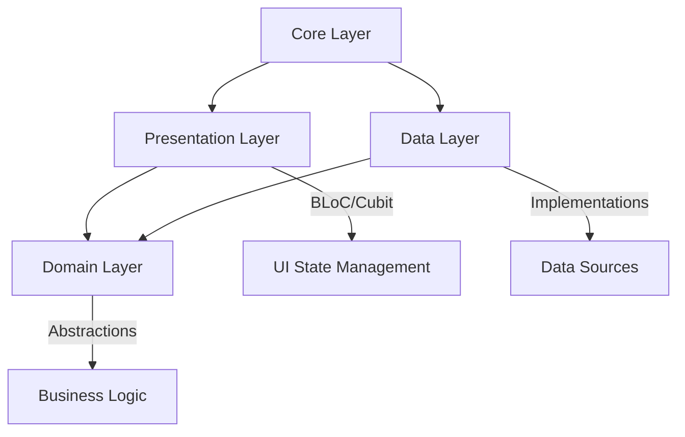

# Clean Architecture en Sonofy

## 📐 Visión General

Sonofy implementa los principios de **Clean Architecture** propuestos por Robert C. Martin, organizando el código en capas bien definidas con responsabilidades específicas y dependencias que fluyen hacia el centro.

## 🏗️ Estructura de Capas

### 1. Presentation Layer (Capa de Presentación)
**Ubicación**: `lib/presentation/`

Esta capa contiene toda la lógica relacionada con la interfaz de usuario:

```dart
presentation/
├── blocs/           # Gestión de estado con BLoC
│   └── playlists/   # 🆕 BLoC para gestión de playlists
├── screens/         # Pantallas principales
│   └── playlist_screen.dart  # 🆕 Pantalla de playlist individual
├── widgets/         # Widgets reutilizables
│   └── options/     # 🆕 Opciones de playlist (crear, editar, eliminar)
└── views/           # Vistas específicas de configuraciones
    └── modal_view.dart      # 🆕 Sistema unificado de modales
```

**Responsabilidades**:
- Renderizado de UI
- Gestión de estado local con BLoC pattern
- Manejo de eventos de usuario
- Navegación entre pantallas
- **🆕 Modales unificados**: Sistema consistente con modalView()
- **🆕 Gestión de opciones**: Implementación completa de funcionalidades

**Dependencias**: Solo depende de la capa de dominio a través de repositorios abstractos.

### 2. Domain Layer (Capa de Dominio)
**Ubicación**: `lib/domain/`

Contiene la lógica de negocio pura y las abstracciones:

```dart
domain/
├── repositories/    # Interfaces de repositorios
│   ├── player_repository.dart
│   ├── playlist_repository.dart     # 🆕 Gestión de playlists
│   ├── settings_repository.dart
│   └── songs_repository.dart
└── usecases/       # Casos de uso de negocio
    ├── get_local_songs_usecase.dart
    ├── get_songs_from_folder_usecase.dart
    ├── select_music_folder_usecase.dart
    └── playlists/   # 🆕 Casos de uso de playlists
        ├── create_playlist_usecase.dart
        ├── delete_playlist_usecase.dart
        ├── get_all_playlists_usecase.dart
        ├── get_playlist_by_id_usecase.dart
        ├── update_playlist_usecase.dart
        ├── add_song_to_playlist_usecase.dart
        ├── remove_song_from_playlist_usecase.dart
        └── reorder_songs_in_playlist_usecase.dart
```

**Responsabilidades**:
- Definir contratos de repositorios
- Implementar casos de uso específicos
- Encapsular lógica de negocio compleja
- Mantener independencia de frameworks

**Dependencias**: No depende de ninguna otra capa (núcleo de la arquitectura).

### 3. Data Layer (Capa de Datos)
**Ubicación**: `lib/data/`

Implementa las abstracciones definidas en la capa de dominio:

```dart
data/
├── models/          # Modelos de datos
│   └── playlist.dart              # 🆕 Modelo de playlist
└── repositories/    # Implementaciones concretas
    ├── player_repository_impl.dart
    ├── playlist_repository_impl.dart  # 🆕 Implementación con SharedPreferences
    ├── settings_repository_impl.dart
    └── songs_repository_impl.dart
```

**Responsabilidades**:
- Implementar interfaces de repositorios
- Manejar persistencia de datos
- Comunicación con APIs externas
- Transformación de datos

**Dependencias**: Depende de la capa de dominio para implementar contratos.

### 4. Core Layer (Capa de Núcleo)
**Ubicación**: `lib/core/`

Contiene utilidades y servicios compartidos:

```dart
core/
├── constants/       # Constantes de la aplicación
├── enums/          # Enumeraciones
├── extensions/     # Extensiones de Dart/Flutter
├── routes/         # Configuración de rutas
├── services/       # Servicios compartidos
├── themes/         # Sistema de temas
├── transitions/    # Transiciones personalizadas
└── utils/          # Utilidades generales
    ├── card_width.dart
    ├── device_platform.dart
    ├── duration_minutes.dart
    ├── mp3_file_converter.dart  # Conversor de archivos MP3
    ├── page_transition.dart
    ├── responsive_layout.dart
    ├── toast.dart
    └── validators.dart
```

## 🔄 Flujo de Dependencias



## 📁 Ejemplo Práctico: Funcionalidad Híbrida iOS/Android

### 1. Arquitectura Específica por Plataforma

Sonofy implementa una arquitectura híbrida que adapta su comportamiento según la plataforma:

- **iOS**: FilePicker + on_audio_query_pluse (selección manual + música del dispositivo)
- **Android**: Solo on_audio_query_pluse (acceso automático a toda la música)

### 2. Flujo de Importación iOS (Selección Manual)

```dart
// 1. Usuario selecciona carpeta en configuraciones (solo iOS)
onPressed: () => context.read<SettingsCubit>().selectAndSetMusicFolder()

// 2. Cubit verifica plataforma y coordina use cases (Domain)
Future<bool> selectAndSetMusicFolder() async {
  // Solo iOS soporta selección de carpetas
  if (_selectMusicFolderUseCase == null || _getSongsFromFolderUseCase == null) {
    return false; // Android retorna false
  }

  final String? selectedPath = await _selectMusicFolderUseCase();
  if (selectedPath != null) {
    final List<File> mp3Files = await _getSongsFromFolderUseCase(selectedPath);
    // Actualizar configuraciones y refrescar biblioteca
  }
}

// 3. Use Case con lógica condicional (Domain)
class GetLocalSongsUseCase {
  Future<List<SongModel>> call() async {
    // Solo iOS soporta canciones locales de carpetas específicas
    if (Platform.isAndroid) {
      return []; // Android no tiene canciones "locales" separadas
    }

    final localPath = _settingsRepository.getSettings().localMusicPath;
    final files = await _songsRepository.getSongsFromFolder(localPath);
    return Mp3FileConverter.convertFilesToSongModels(files);
  }
}

// 4. Implementación con comportamiento específico (Data)
Future<String?> selectMusicFolder() async {
  // Solo iOS soporta selección manual de carpetas
  if (Platform.isIOS) {
    try {
      final String? selectedDirectory = await FilePicker.platform.getDirectoryPath();
      return selectedDirectory;
    } catch (e) {
      return null;
    }
  }
  // Android no soporta selección manual, retorna null
  return null;
}
```

### 3. Flujo Android (Acceso Automático)

```dart
// Android: Solo usa on_audio_query_pluse para toda la música
Future<void> loadAllSongs() async {
  final deviceSongs = await _songsRepository.getSongsFromDevice();
  
  if (Platform.isIOS && _getLocalSongsUseCase != null) {
    // iOS: combinar canciones del dispositivo + locales
    final localSongs = await _getLocalSongsUseCase();
    final allSongs = [...deviceSongs, ...localSongs];
  } else {
    // Android: solo canciones del dispositivo (incluye toda la música)
    final allSongs = deviceSongs;
  }
}
```

### 2. Conversión de Archivos MP3

```dart
// Utility en Core Layer
class Mp3FileConverter {
  static List<SongModel> convertFilesToSongModels(List<File> files) {
    return files.map(_convertFileToSongModel).toList();
  }
  
  static SongModel _convertFileToSongModel(File file) {
    final durationMs = _estimateDurationFromFileSize(file.lengthSync());
    final artistName = _extractArtistFromFileName(file.path);
    // Crear SongModel con metadatos estimados
  }
}
```

## 📋 Ejemplo Práctico: Sistema de Playlists

### 1. Flujo Completo de Creación de Playlist

```dart
// 1. Usuario crea playlist desde UI (Presentation)
onPressed: () => modalView(
  context,
  title: context.tr('options.create_playlist'),
  children: [CreatePlaylistForm()],
)

// 2. Form llama al Cubit (Presentation)
onPressed: () => context.read<PlaylistsCubit>().createPlaylist(name.trim())

// 3. Cubit coordina con Use Case (Domain)
Future<void> createPlaylist(String name) async {
  emit(state.copyWith(isCreating: true));
  try {
    final playlist = await _createPlaylistUseCase(name);
    final updatedPlaylists = [...state.playlists, playlist];
    emit(state.copyWith(
      playlists: updatedPlaylists,
      isCreating: false,
    ));
  } catch (e) {
    emit(state.copyWith(
      error: e.toString(),
      isCreating: false,
    ));
  }
}

// 4. Use Case ejecuta lógica de negocio (Domain)
class CreatePlaylistUseCase {
  final PlaylistRepository _repository;
  
  Future<Playlist> call(String name) async {
    return await _repository.createPlaylist(name);
  }
}

// 5. Implementación persiste datos (Data)
@override
Future<Playlist> createPlaylist(String name) async {
  final newPlaylist = Playlist(
    id: DateTime.now().millisecondsSinceEpoch.toString(),
    title: name,
    songIds: [],
    createdAt: DateTime.now(),
  );
  
  final playlists = await getAllPlaylists();
  playlists.add(newPlaylist);
  
  await _prefs.setString(_playlistsKey, jsonEncode(
    playlists.map((p) => p.toJson()).toList(),
  ));
  
  return newPlaylist;
}
```

### 2. Persistencia con SharedPreferences

```dart
// PlaylistRepositoryImpl - Manejo de datos locales
class PlaylistRepositoryImpl implements PlaylistRepository {
  final SharedPreferences _prefs;
  static const String _playlistsKey = 'user_playlists';

  // Serialización/Deserialización JSON
  @override
  Future<List<Playlist>> getAllPlaylists() async {
    final String? playlistsJson = _prefs.getString(_playlistsKey);
    if (playlistsJson == null) return [];
    
    final List<dynamic> playlistsList = jsonDecode(playlistsJson);
    return playlistsList.map((json) => Playlist.fromJson(json)).toList();
  }

  // Operaciones CRUD completas
  @override
  Future<Playlist> addSongToPlaylist(String playlistId, String songId) async {
    final playlists = await getAllPlaylists();
    final playlist = playlists.firstWhere((p) => p.id == playlistId);
    
    final updatedPlaylist = playlist.copyWith(
      songIds: [...playlist.songIds, songId],
    );
    
    final updatedPlaylists = playlists.map((p) => 
      p.id == playlistId ? updatedPlaylist : p
    ).toList();
    
    await _saveAllPlaylists(updatedPlaylists);
    return updatedPlaylist;
  }
}
```

### 3. Gestión de Estado con BLoC

```dart
// PlaylistsState - Estado inmutable
class PlaylistsState {
  final List<Playlist> playlists;
  final Playlist? selectedPlaylist;
  final bool isLoading;
  final bool isCreating;
  final String? error;

  // Getters computed
  bool get hasPlaylists => playlists.isNotEmpty;
  
  // Copy with para actualizaciones inmutables
  PlaylistsState copyWith({
    List<Playlist>? playlists,
    Playlist? selectedPlaylist,
    bool? clearSelectedPlaylist,
    bool? isLoading,
    String? error,
  }) => PlaylistsState(
    playlists: playlists ?? this.playlists,
    selectedPlaylist: (clearSelectedPlaylist ?? false) 
        ? null 
        : selectedPlaylist ?? this.selectedPlaylist,
    // ...
  );
}

// PlaylistsCubit - Gestión de estado
class PlaylistsCubit extends Cubit<PlaylistsState> {
  // Inyección de todos los use cases necesarios
  final GetAllPlaylistsUseCase _getAllPlaylistsUseCase;
  final CreatePlaylistUseCase _createPlaylistUseCase;
  final DeletePlaylistUseCase _deletePlaylistUseCase;
  final UpdatePlaylistUseCase _updatePlaylistUseCase;
  final AddSongToPlaylistUseCase _addSongToPlaylistUseCase;
  final RemoveSongFromPlaylistUseCase _removeSongFromPlaylistUseCase;

  // Operaciones públicas que coordinan use cases
  Future<void> loadPlaylists() async {
    emit(state.copyWith(isLoading: true));
    final playlists = await _getAllPlaylistsUseCase();
    emit(state.copyWith(playlists: playlists, isLoading: false));
  }
}
```

## 📱 Ejemplo Práctico: Reproducción de Audio

### 1. Flujo de Reproducción

```dart
// 1. Usuario presiona play en la UI (Presentation)
onPressed: () => context.read<PlayerCubit>().setPlayingSong(playlist, song)

// 2. Cubit llama al repositorio (Domain)
Future<void> setPlayingSong(List<SongModel> playlist, SongModel song) async {
  final bool isPlaying = await _playerRepository.play(song.data);
  // ...
}

// 3. Implementación del repositorio (Data)
@override
Future<bool> play(String url) async {
  await player.play(DeviceFileSource(url));
  return isPlaying();
}
```

### 2. Gestión de Estado

```dart
// PlayerCubit (Presentation)
class PlayerCubit extends Cubit<PlayerState> {
  final PlayerRepository _playerRepository; // Dependencia de Domain
  
  PlayerCubit(this._playerRepository) : super(PlayerState.initial());
  // ...
}

// PlayerRepository (Domain)
abstract class PlayerRepository {
  Future<bool> play(String url);
  Future<bool> pause();
  Future<bool> togglePlayPause();
  // ...
}

// PlayerRepositoryImpl (Data)
final class PlayerRepositoryImpl implements PlayerRepository {
  final player = AudioPlayer(); // Dependencia externa
  // ...
}
```

## 🎯 Beneficios de la Arquitectura

### ✅ Separación de Responsabilidades
- Cada capa tiene un propósito específico
- Facilita el mantenimiento y testing
- Reduce el acoplamiento entre componentes

### ✅ Testabilidad
- La lógica de negocio es independiente de Flutter
- Fácil creación de mocks para testing
- Tests unitarios aislados por capa

### ✅ Flexibilidad
- Cambio de implementaciones sin afectar otras capas
- Fácil migración a otros frameworks de audio
- Extensibilidad para nuevas características

### ✅ Escalabilidad
- Estructura clara para equipos grandes
- Fácil onboarding de nuevos desarrolladores
- Crecimiento organizado del código

## 🔧 Inyección de Dependencias Condicional

```dart
// main.dart - Configuración híbrida de dependencias
Future<void> main() async {
  // Repositorios concretos (Data Layer) - Ambas plataformas
  final SettingsRepository settingsRepository = SettingsRepositoryImpl();
  final SongsRepository songsRepository = SongsRepositoryImpl();
  final PlayerRepository playerRepository = PlayerRepositoryImpl();

  // Use Cases para música local - SOLO iOS
  SelectMusicFolderUseCase? selectMusicFolderUseCase;
  GetSongsFromFolderUseCase? getSongsFromFolderUseCase;
  GetLocalSongsUseCase? getLocalSongsUseCase;

  if (Platform.isIOS) {
    // Inicializar Use Cases solo en iOS
    selectMusicFolderUseCase = SelectMusicFolderUseCase(songsRepository);
    getSongsFromFolderUseCase = GetSongsFromFolderUseCase(songsRepository);
    getLocalSongsUseCase = GetLocalSongsUseCase(songsRepository, settingsRepository);
  }
  // Android: Use Cases permanecen como null

  runApp(
    MultiBlocProvider(
      providers: [
        // Cubits con dependencias opcionales
        BlocProvider<SettingsCubit>(
          create: (context) => SettingsCubit(
            settingsRepository,
            selectMusicFolderUseCase, // null en Android
            getSongsFromFolderUseCase, // null en Android
          ),
        ),
        BlocProvider<SongsCubit>(
          create: (context) => SongsCubit(
            songsRepository,
            getLocalSongsUseCase, // null en Android
          ),
        ),
        BlocProvider<PlayerCubit>(
          create: (context) => PlayerCubit(playerRepository),
        ),
      ],
      child: const MainApp(),
    ),
  );
}
```

### Manejo de Dependencias Opcionales

```dart
// SettingsCubit con Use Cases opcionales
class SettingsCubit extends Cubit<SettingsState> {
  final SettingsRepository _settingsRepository;
  final SelectMusicFolderUseCase? _selectMusicFolderUseCase; // Opcional
  final GetSongsFromFolderUseCase? _getSongsFromFolderUseCase; // Opcional

  SettingsCubit(
    this._settingsRepository,
    this._selectMusicFolderUseCase,
    this._getSongsFromFolderUseCase,
  ) : super(SettingsState.initial());

  Future<bool> selectAndSetMusicFolder() async {
    // Verificación de null safety
    if (_selectMusicFolderUseCase == null || _getSongsFromFolderUseCase == null) {
      return false; // Android siempre retorna false
    }
    // Lógica de iOS...
  }
}

// SongsCubit con GetLocalSongsUseCase opcional
class SongsCubit extends Cubit<SongsState> {
  final SongsRepository _songsRepository;
  final GetLocalSongsUseCase? _getLocalSongsUseCase; // Opcional

  Future<void> loadAllSongs() async {
    final deviceSongs = await _songsRepository.getSongsFromDevice();
    
    if (Platform.isIOS && _getLocalSongsUseCase != null) {
      // iOS: combinar fuentes
      final localSongs = await _getLocalSongsUseCase();
      final allSongs = [...deviceSongs, ...localSongs];
    } else {
      // Android: solo dispositivo
      final allSongs = deviceSongs;
    }
  }
}
```

## 📏 Principios SOLID Aplicados

### Single Responsibility Principle (SRP)
- Cada repositorio tiene una responsabilidad específica
- Cubits manejan solo el estado de su dominio

### Open/Closed Principle (OCP)
- Extensible a través de nuevas implementaciones
- Cerrado para modificación en interfaces

### Liskov Substitution Principle (LSP)
- Implementaciones intercambiables de repositorios
- Contratos claros en interfaces

### Interface Segregation Principle (ISP)
- Interfaces específicas por funcionalidad
- No fuerza implementación de métodos innecesarios

### Dependency Inversion Principle (DIP)
- Dependencia de abstracciones, no concreciones
- Inyección de dependencias en lugar de instanciación directa

## 🎨 Patrones de Diseño Utilizados

### Repository Pattern
- Abstrae el acceso a datos
- Centraliza la lógica de obtención de datos

### BLoC Pattern
- Separación de lógica de negocio y UI
- Gestión de estado predecible

### Dependency Injection
- Inversión de control
- Facilita testing y flexibilidad

---

Esta arquitectura proporciona una base sólida para el crecimiento y mantenimiento de Sonofy, asegurando código limpio, testeable y escalable.