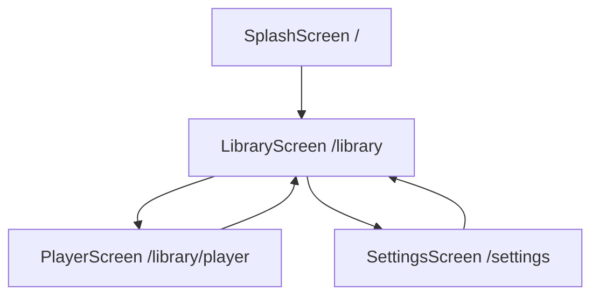

# Documentación de Pantallas

## 📱 Visión General

Sonofy cuenta con cuatro pantallas principales que forman el flujo completo de la aplicación. Cada pantalla está diseñada siguiendo principios de Material Design y utiliza el patrón BLoC para gestión de estado.

## 🚀 SplashScreen

### Propósito
Pantalla de carga inicial que se muestra al abrir la aplicación, proporcionando tiempo para inicializar servicios y cargar configuraciones.

### Ubicación
`lib/presentation/screens/splash_screen.dart`

### Características
- **Duración controlada**: Transición automática después de inicialización
- **Diseño minimalista**: Logo y indicador de carga
- **Redirección inteligente**: Navega automáticamente a LibraryScreen

### Implementación
```dart
class SplashScreen extends StatelessWidget {
  const SplashScreen({super.key});

  @override
  Widget build(BuildContext context) {
    return Scaffold(
      backgroundColor: Theme.of(context).colorScheme.primary,
      body: Center(
        child: Column(
          mainAxisAlignment: MainAxisAlignment.center,
          children: [
            // Logo de la aplicación
            Icon(
              Icons.music_note,
              size: 80,
              color: Colors.white,
            ),
            const SizedBox(height: 24),
            
            // Nombre de la app
            Text(
              'Sonofy',
              style: TextStyle(
                fontSize: 32,
                fontWeight: FontWeight.bold,
                color: Colors.white,
              ),
            ),
            const SizedBox(height: 48),
            
            // Indicador de carga
            CircularProgressIndicator(
              valueColor: AlwaysStoppedAnimation<Color>(Colors.white),
            ),
          ],
        ),
      ),
    );
  }
}
```

### Navegación
- **Origen**: Punto de entrada de la aplicación (`/`)
- **Destino**: LibraryScreen (`/library`) después de inicialización
- **Transición**: Redirección automática controlada por AppRoutes

## 📚 LibraryScreen

### Propósito
Pantalla principal que muestra la biblioteca de música del usuario con lista de canciones y reproductor mini.

### Ubicación
`lib/presentation/screens/library_screen.dart`

### Características
- **Lista de canciones**: ScrollView con todas las canciones del dispositivo
- **Reproductor mini**: Control de reproducción en la parte inferior
- **AppBar personalizada**: Búsqueda y configuraciones
- **Estados de carga**: Indicadores visuales durante carga de biblioteca

### Estructura Visual
```
┌─────────────────────────────────┐
│ AppBar                          │
│ [🔍] Sonofy            [⚙️]    │
├─────────────────────────────────┤
│ Biblioteca                      │
│                                 │
│ ♪ Canción 1 - Artista 1        │
│ ♪ Canción 2 - Artista 2        │
│ ♪ Canción 3 - Artista 3        │
│ ...                             │
│                                 │
├─────────────────────────────────┤
│ Bottom Player                   │
│ [♪] Canción Actual    [⏸️]     │
└─────────────────────────────────┘
```

### Implementación Clave
```dart
class LibraryScreen extends StatelessWidget {
  static const String routeName = 'library';

  @override
  Widget build(BuildContext context) {
    return PopScope(
      canPop: false, // Prevenir navegación hacia atrás
      child: Scaffold(
        appBar: _buildAppBar(context),
        body: _buildBody(context),
        bottomSheet: _buildBottomPlayer(context),
      ),
    );
  }

  Widget _buildBody(BuildContext context) {
    return BlocBuilder<SongsCubit, SongsState>(
      builder: (context, state) {
        if (state.isLoading) {
          return _buildLoadingState();
        }

        return ListView.builder(
          padding: const EdgeInsets.symmetric(horizontal: 24.0),
          itemCount: state.songs.length + 2, // +2 para título y espaciado
          itemBuilder: (context, index) {
            if (index == 0) {
              return _buildTitle(context);
            } else if (index == state.songs.length + 1) {
              return _buildBottomSpacing();
            } else {
              return SongCard(
                playlist: state.songs,
                song: state.songs[index - 1],
              );
            }
          },
        );
      },
    );
  }
}
```

### Componentes Principales
- **AppBar**: Navegación y acceso a configuraciones
- **SongCard**: Widgets individuales para cada canción
- **BottomPlayer**: Reproductor mini persistente
- **Loading States**: Indicadores de carga y estados vacíos

### Estados Manejados
- **Loading**: Cargando biblioteca de música
- **Loaded**: Biblioteca cargada exitosamente
- **Empty**: Sin canciones encontradas
- **Error**: Error al cargar biblioteca

### Navegación
- **Desde**: SplashScreen
- **Hacia**: PlayerScreen (reproductor completo), SettingsScreen (configuraciones)

## 🎵 PlayerScreen

### Propósito
Reproductor de música de pantalla completa con controles avanzados y visualización de carátula.

### Ubicación
`lib/presentation/screens/player_screen.dart`

### Características
- **Diseño inmersivo**: Carátula de álbum como fondo
- **Controles completos**: Play/pause, anterior/siguiente, slider de progreso
- **Información detallada**: Título, artista, duración
- **Transiciones Hero**: Animaciones suaves desde BottomPlayer
- **Modal de letras**: Acceso a letras de canciones (preparado)

### Estructura Visual
```
┌─────────────────────────────────┐
│ [←] REPRODUCIENDO AHORA    [♡]  │
│                                 │
│                                 │
│        🖼️ CARÁTULA              │
│                                 │
│                                 │
│                                 │
├─────────────────────────────────┤
│ ●────────●───────────────── 2:30│
│                                 │
│        Nombre de Canción        │
│           Artista               │
│                                 │
│     [⏮️]  [⏸️]  [⏭️]           │
│                                 │
│            [📝 Letra]           │
└─────────────────────────────────┘
```

### Implementación Clave
```dart
class PlayerScreen extends StatelessWidget {
  static const String routeName = 'player';

  @override
  Widget build(BuildContext context) {
    return BlocBuilder<PlayerCubit, PlayerState>(
      builder: (context, state) {
        final currentSong = state.currentSong;
        
        return Scaffold(
          extendBodyBehindAppBar: true,
          appBar: _buildAppBar(context),
          body: _buildBody(context, currentSong),
          bottomNavigationBar: const PlayerLyrics(),
        );
      },
    );
  }

  Widget _buildBody(BuildContext context, SongModel? currentSong) {
    return Stack(
      children: [
        // Fondo con carátula
        _buildArtworkBackground(context, currentSong),
        
        // Overlay oscuro
        _buildDarkOverlay(context),
        
        // Contenido principal
        _buildMainContent(context, currentSong),
      ],
    );
  }

  Widget _buildMainContent(BuildContext context, SongModel? currentSong) {
    return Column(
      children: [
        const Spacer(),
        Hero(
          tag: 'player_container',
          child: Material(
            type: MaterialType.transparency,
            child: BottomClipperContainer(
              child: Column(
                children: [
                  const PlayerSlider(),
                  _buildSongInfo(context, currentSong),
                  const PlayerControl(),
                ],
              ),
            ),
          ),
        ),
      ],
    );
  }
}
```

### Componentes Principales
- **QueryArtworkWidget**: Visualización de carátula con fallback
- **PlayerSlider**: Control de progreso interactivo
- **PlayerControl**: Botones de control principal
- **PlayerLyrics**: Modal para letras (preparado)
- **BottomClipperContainer**: Contenedor con diseño recortado

### Estados Visuales
- **Con carátula**: Carátula como fondo con overlay
- **Sin carátula**: Imagen placeholder con gradiente
- **Reproduciendo**: Botón pause visible
- **Pausado**: Botón play visible

### Transiciones
- **Hero Animation**: Transición suave desde BottomPlayer
- **Slide Transition**: Deslizamiento desde la parte inferior
- **Fade Overlay**: Transición de opacidad para el fondo

### Navegación
- **Desde**: LibraryScreen (tap en BottomPlayer o SongCard)
- **Hacia**: LibraryScreen (botón back)

## ⚙️ SettingsScreen

### Propósito
Pantalla de configuraciones que permite personalizar la apariencia, idioma y preferencias de la aplicación.

### Ubicación
`lib/presentation/screens/settings_screen.dart`

### Características
- **Configuración de apariencia**: Tema claro/oscuro, color primario
- **Escalado de fuente**: Ajuste de tamaño de texto
- **Configuración de idioma**: Selección de idioma (preparado)
- **Configuración de seguridad**: Autenticación biométrica (preparado)
- **Organización por secciones**: Agrupación lógica de configuraciones

### Estructura Visual
```
┌─────────────────────────────────┐
│ [←] Configuraciones             │
├─────────────────────────────────┤
│                                 │
│ 🎨 Apariencia                   │
│ ├─ Tema del sistema        [>]  │
│ ├─ Color primario          [●]  │
│ └─ Tamaño de fuente        [>]  │
│                                 │
│ 🌍 Idioma                       │
│ └─ Español                 [>]  │
│                                 │
│ 🔒 Seguridad                    │
│ └─ Autenticación biométrica [○] │
│                                 │
│                                 │
│            [Restaurar]          │
└─────────────────────────────────┘
```

### Implementación Clave
```dart
class SettingsScreen extends StatelessWidget {
  static const String routeName = 'settings';

  @override
  Widget build(BuildContext context) {
    return Scaffold(
      appBar: _buildAppBar(context),
      body: BlocBuilder<SettingsCubit, SettingsState>(
        builder: (context, state) {
          if (state.isLoading) {
            return const Center(child: CircularProgressIndicator());
          }

          return SingleChildScrollView(
            padding: const EdgeInsets.all(24.0),
            child: Column(
              children: [
                AppearanceSection(settings: state.settings),
                const SizedBox(height: 24),
                LanguageSection(settings: state.settings),
                const SizedBox(height: 24),
                SecuritySection(settings: state.settings),
                const SizedBox(height: 32),
                _buildResetButton(context),
              ],
            ),
          );
        },
      ),
    );
  }
}
```

### Secciones de Configuración

#### AppearanceSection
```dart
class AppearanceSection extends StatelessWidget {
  final Settings settings;

  @override
  Widget build(BuildContext context) {
    return SectionCard(
      title: context.tr('settings.appearance.title'),
      icon: FontAwesomeIcons.lightPalette,
      children: [
        SectionItem(
          title: context.tr('settings.appearance.theme_mode'),
          subtitle: _getThemeModeDescription(settings.themeMode),
          onTap: () => _showThemeModeSelector(context),
        ),
        SectionItem(
          title: context.tr('settings.appearance.primary_color'),
          trailing: _buildColorIndicator(settings.primaryColor),
          onTap: () => _showColorPicker(context),
        ),
        SectionItem(
          title: context.tr('settings.appearance.font_size'),
          subtitle: _getFontSizeDescription(settings.fontSize),
          onTap: () => _showFontSizeSelector(context),
        ),
      ],
    );
  }
}
```

#### Configuraciones Disponibles

| Sección | Configuración | Tipo | Valores |
|---------|---------------|------|---------|
| **Apariencia** | Modo de tema | Selector | Sistema/Claro/Oscuro |
| | Color primario | Color picker | 8 colores predefinidos |
| | Tamaño de fuente | Slider | 0.8x - 1.4x |
| **Idioma** | Idioma de la app | Selector | Español/Inglés |
| **Seguridad** | Auth. biométrica | Toggle | On/Off |

### Estados Manejados
- **Loading**: Cargando configuraciones
- **Loaded**: Configuraciones listas para editar
- **Saving**: Guardando cambios
- **Error**: Error al cargar/guardar

### Navegación
- **Desde**: LibraryScreen (botón configuraciones en AppBar)
- **Hacia**: LibraryScreen (botón back o navegación del sistema)

## 🔄 Flujo de Navegación

### Estructura de Rutas


### Configuración en AppRoutes
```dart
class AppRoutes {
  static RouterConfig<Object>? getGoRoutes(GlobalKey<NavigatorState> navigatorKey) {
    return GoRouter(
      routes: [
        GoRoute(
          path: '/',
          builder: (context, state) => const SplashScreen(),
          routes: [
            GoRoute(
              path: LibraryScreen.routeName,
              name: LibraryScreen.routeName,
              pageBuilder: (context, state) => PageTransition(
                page: const LibraryScreen(),
              ).fadeTransition(),
              routes: [
                GoRoute(
                  path: PlayerScreen.routeName,
                  name: PlayerScreen.routeName,
                  pageBuilder: (context, state) => PlayerSlideTransition(
                    child: const PlayerScreen(),
                  ),
                ),
              ],
            ),
          ],
        ),
        GoRoute(
          path: '/${SettingsScreen.routeName}',
          name: SettingsScreen.routeName,
          builder: (context, state) => const SettingsScreen(),
        ),
      ],
    );
  }
}
```

## 🎨 Transiciones y Animaciones

### Tipos de Transiciones
- **Fade**: Entre SplashScreen y LibraryScreen
- **Slide**: Para PlayerScreen desde la parte inferior
- **Hero**: Para elementos compartidos (BottomPlayer → PlayerScreen)

### PlayerSlideTransition
```dart
class PlayerSlideTransition extends CustomTransitionPage<void> {
  PlayerSlideTransition({
    required Widget child,
    LocalKey? key,
    String? name,
    Object? arguments,
  }) : super(
          child: child,
          transitionsBuilder: (context, animation, secondaryAnimation, child) {
            return SlideTransition(
              position: Tween<Offset>(
                begin: const Offset(0.0, 1.0),
                end: Offset.zero,
              ).animate(CurvedAnimation(
                parent: animation,
                curve: Curves.easeInOut,
              )),
              child: child,
            );
          },
        );
}
```

## 📱 Consideraciones Responsivas

### Adaptación por Tamaño
```dart
// En cada pantalla
Widget build(BuildContext context) {
  final size = MediaQuery.of(context).size;
  final isTablet = size.width > 600;
  
  return Scaffold(
    body: isTablet ? _buildTabletLayout() : _buildMobileLayout(),
  );
}
```

### Safe Areas
```dart
// Manejo de áreas seguras
body: SafeArea(
  child: content,
)

// Para PlayerScreen con AppBar transparente
extendBodyBehindAppBar: true,
```

## 🔮 Mejoras Futuras

### Pantallas Adicionales
- **SearchScreen**: Búsqueda avanzada de canciones
- **PlaylistScreen**: Gestión de playlists personalizadas
- **EqualizerScreen**: Control de audio avanzado
- **AboutScreen**: Información de la aplicación

### Mejoras de UX
- **Swipe Gestures**: Navegación por gestos
- **Contextual Menus**: Menús contextuales para canciones
- **Mini Player Expandible**: Transición más fluida
- **Dark Mode Automático**: Basado en hora del día

Las pantallas de Sonofy proporcionan una experiencia de usuario cohesiva y moderna, con navegación intuitiva y diseño responsivo que se adapta a diferentes dispositivos y preferencias del usuario.