# Guía Completa del Sistema de Playlists

## 📋 Visión General

El Sistema de Playlists de Sonofy permite a los usuarios crear, gestionar y personalizar listas de reproducción de manera intuitiva y eficiente. Implementado siguiendo Clean Architecture y BLoC pattern, ofrece una experiencia robusta y escalable.

## 🎯 Funcionalidades Principales

### ✅ Gestión Completa de Playlists
- **Crear**: Playlists personalizadas con nombres únicos
- **Editar**: Renombrar playlists existentes  
- **Eliminar**: Borrar playlists con confirmación
- **Visualizar**: Lista organizada en Library Screen

### ✅ Gestión de Contenido
- **Agregar Canciones**: Desde Player, Library o Playlist Screen
- **Quitar Canciones**: Desde opciones de playlist o player
- **Navegación**: Acceso directo a playlist individual
- **Contadores**: Visualización de cantidad de canciones

### ✅ Persistencia y Sincronización
- **Almacenamiento Local**: SharedPreferences para persistencia
- **Sincronización Automática**: Estado actualizado en tiempo real
- **Recuperación**: Datos mantenidos entre sesiones de app

## 🏗️ Arquitectura del Sistema

### Capa de Dominio (Domain Layer)

#### PlaylistRepository Interface
```dart
abstract class PlaylistRepository {
  Future<List<Playlist>> getAllPlaylists();
  Future<Playlist?> getPlaylistById(String id);
  Future<Playlist> createPlaylist(String name);
  Future<Playlist> updatePlaylist(Playlist playlist);
  Future<void> deletePlaylist(String id);
  Future<Playlist> addSongToPlaylist(String playlistId, String songId);
  Future<Playlist> removeSongFromPlaylist(String playlistId, String songId);
  Future<Playlist> reorderSongsInPlaylist(String playlistId, List<String> newOrder);
}
```

#### Use Cases Implementados
| Use Case | Propósito | Input | Output |
|----------|-----------|-------|--------|
| `GetAllPlaylistsUseCase` | Obtener todas las playlists | - | `List<Playlist>` |
| `GetPlaylistByIdUseCase` | Obtener playlist específica | `String id` | `Playlist?` |
| `CreatePlaylistUseCase` | Crear nueva playlist | `String name` | `Playlist` |
| `DeletePlaylistUseCase` | Eliminar playlist | `String id` | `void` |
| `UpdatePlaylistUseCase` | Actualizar playlist | `Playlist` | `Playlist` |
| `AddSongToPlaylistUseCase` | Agregar canción | `String playlistId, String songId` | `Playlist` |
| `RemoveSongFromPlaylistUseCase` | Quitar canción | `String playlistId, String songId` | `Playlist` |
| `ReorderSongsInPlaylistUseCase` | Reordenar canciones | `String playlistId, List<String> order` | `Playlist` |

### Capa de Datos (Data Layer)

#### Modelo de Playlist
```dart
class Playlist {
  final String id;
  final String title;
  final List<String> songIds;
  final DateTime createdAt;
  final DateTime? updatedAt;

  // Métodos de conveniencia
  bool containsSong(String songId) => songIds.contains(songId);
  int get songCount => songIds.length;
  bool get isEmpty => songIds.isEmpty;
  bool get isNotEmpty => songIds.isNotEmpty;

  // Serialización JSON
  Map<String, dynamic> toJson();
  factory Playlist.fromJson(Map<String, dynamic> json);
}
```

#### Implementación de Persistencia
```dart
class PlaylistRepositoryImpl implements PlaylistRepository {
  final SharedPreferences _prefs;
  static const String _playlistsKey = 'user_playlists';

  // CRUD Operations con manejo de errores
  @override
  Future<List<Playlist>> getAllPlaylists() async {
    try {
      final String? playlistsJson = _prefs.getString(_playlistsKey);
      if (playlistsJson == null) return [];
      
      final List<dynamic> playlistsList = jsonDecode(playlistsJson);
      return playlistsList.map((json) => Playlist.fromJson(json)).toList();
    } catch (e) {
      return []; // Fallback seguro
    }
  }

  @override
  Future<Playlist> createPlaylist(String name) async {
    final newPlaylist = Playlist(
      id: DateTime.now().millisecondsSinceEpoch.toString(),
      title: name.trim(),
      songIds: [],
      createdAt: DateTime.now(),
    );
    
    final playlists = await getAllPlaylists();
    playlists.add(newPlaylist);
    await _saveAllPlaylists(playlists);
    
    return newPlaylist;
  }
}
```

### Capa de Presentación (Presentation Layer)

#### Gestión de Estado con BLoC

##### PlaylistsState
```dart
class PlaylistsState {
  final List<Playlist> playlists;
  final Playlist? selectedPlaylist;
  final bool isLoading;
  final bool isCreating;
  final bool isDeleting;
  final String? error;

  // Computed properties
  bool get hasPlaylists => playlists.isNotEmpty;
  bool get hasSelectedPlaylist => selectedPlaylist != null;

  // Immutable updates
  PlaylistsState copyWith({
    List<Playlist>? playlists,
    Playlist? selectedPlaylist,
    bool? clearSelectedPlaylist,
    bool? isLoading,
    bool? isCreating,
    bool? isDeleting,
    String? error,
    bool? clearError,
  });
}
```

##### PlaylistsCubit
```dart
class PlaylistsCubit extends Cubit<PlaylistsState> {
  // Inyección de dependencias (Use Cases)
  final GetAllPlaylistsUseCase _getAllPlaylistsUseCase;
  final CreatePlaylistUseCase _createPlaylistUseCase;
  final DeletePlaylistUseCase _deletePlaylistUseCase;
  final UpdatePlaylistUseCase _updatePlaylistUseCase;
  final AddSongToPlaylistUseCase _addSongToPlaylistUseCase;
  final RemoveSongFromPlaylistUseCase _removeSongFromPlaylistUseCase;

  // Operaciones públicas con manejo de estado
  Future<void> loadPlaylists() async {
    emit(state.copyWith(isLoading: true));
    try {
      final playlists = await _getAllPlaylistsUseCase();
      emit(state.copyWith(playlists: playlists, isLoading: false));
    } catch (e) {
      emit(state.copyWith(error: e.toString(), isLoading: false));
    }
  }

  Future<void> createPlaylist(String name) async {
    emit(state.copyWith(isCreating: true));
    try {
      final playlist = await _createPlaylistUseCase(name);
      final updatedPlaylists = [...state.playlists, playlist];
      emit(state.copyWith(
        playlists: updatedPlaylists,
        isCreating: false,
      ));
    } catch (e) {
      emit(state.copyWith(error: e.toString(), isCreating: false));
    }
  }
}
```

## 🎨 Interfaz de Usuario

### Library Screen - Sección de Playlists
```dart
// Visualización de playlists con estado
BlocBuilder<PlaylistsCubit, PlaylistsState>(
  builder: (context, playlistsState) {
    if (playlistsState.hasPlaylists) {
      return SingleChildScrollView(
        scrollDirection: Axis.horizontal,
        child: Row(
          children: playlistsState.playlists
              .map((playlist) => PlaylistCard(playlist: playlist))
              .toList(),
        ),
      );
    } else {
      return EmptyPlaylistsWidget();
    }
  },
)
```

### Sistema de Modales Unificado

#### Crear Playlist
```dart
// Acceso desde OptionsModal.library()
modalView(
  context,
  title: context.tr('options.create_playlist'),
  maxHeight: 0.4,
  children: [CreatePlaylistForm()],
)

// CreatePlaylistForm - Widget con TextField y botones
class CreatePlaylistForm extends StatefulWidget {
  // Manejo de input con validación
  void _createPlaylist(String name) {
    if (name.trim().isNotEmpty) {
      context.pop();
      context.read<PlaylistsCubit>().createPlaylist(name.trim());
      Toast.show(context.tr('playlist.created_successfully'));
    }
  }
}
```

#### Agregar Canción a Playlist
```dart
// Desde Player Screen u Options Modal
modalView(
  context,
  title: context.tr('options.add_playlist'),
  children: [PlaylistSelectorForm(songId: currentSong.id)],
)

// PlaylistSelectorForm - Lista de playlists disponibles
class PlaylistSelectorForm extends StatelessWidget {
  Widget build(BuildContext context) {
    return BlocBuilder<PlaylistsCubit, PlaylistsState>(
      builder: (context, state) {
        if (!state.hasPlaylists) {
          return CreateFirstPlaylistPrompt();
        }
        
        return ListView.builder(
          itemCount: state.playlists.length + 1, // +1 para "Crear Nueva"
          itemBuilder: (context, index) {
            if (index == state.playlists.length) {
              return CreateNewPlaylistTile();
            }
            
            final playlist = state.playlists[index];
            final alreadyAdded = playlist.containsSong(songId);
            
            return PlaylistTile(
              playlist: playlist,
              enabled: !alreadyAdded,
              onTap: () => _addSongToPlaylist(playlist),
            );
          },
        );
      },
    );
  }
}
```

#### Opciones de Playlist Individual
```dart
// Renombrar Playlist
modalView(
  context,
  title: context.tr('options.rename_playlist'),
  maxHeight: 0.4,
  children: [RenamePlaylistForm(playlist: selectedPlaylist)],
)

// Eliminar Playlist (con confirmación)
modalView(
  context,
  title: context.tr('options.delete_playlist'),
  maxHeight: 0.4,
  children: [DeletePlaylistForm(playlist: selectedPlaylist)],
)
```

## 🔄 Flujos de Usuario Principales

### 1. Flujo de Creación de Playlist


### 2. Flujo de Agregar Canción

```mermaid
sequenceDiagram
    participant U as Usuario
    participant P as Player Screen
    participant M as Modal System
    participant C as PlaylistsCubit
    participant UC as AddSongToPlaylistUseCase
    participant R as PlaylistRepository

    U->>P: Tap en Opciones (durante reproducción)
    P->>M: OptionsModal.player()
    U->>M: Tap "Agregar a Playlist"
    M->>M: modalView(PlaylistSelectorForm)
    M->>C: Cargar playlists existentes
    C-->>M: Lista de playlists
    U->>M: Seleccionar playlist destino
    M->>C: addSongToPlaylist(playlistId, songId)
    C->>UC: call(playlistId, songId)
    UC->>R: addSongToPlaylist(...)
    R->>R: Actualizar playlist JSON
    R-->>UC: Playlist actualizada
    UC-->>C: Playlist actualizada
    C-->>M: Estado actualizado
    M->>M: Mostrar toast confirmación
    M->>M: Cerrar modal
```



### 3. Flujo de Navegación a Playlist


## 📱 Integración con Otras Funcionalidades

### Player Integration
```dart
// Agregar canción desde reproductor actual
void addCurrentSongToPlaylist() {
  final playerState = context.read<PlayerCubit>().state;
  if (playerState.hasSelectedSong) {
    modalView(
      context,
      title: context.tr('options.add_playlist'),
      children: [PlaylistSelectorForm(songId: playerState.currentSong!.id)],
    );
  }
}

// Reproducir playlist completa
void playPlaylist(Playlist playlist) {
  final songsState = context.read<SongsCubit>().state;
  final playlistSongs = songsState.allSongs
      .where((song) => playlist.containsSong(song.id))
      .toList();
      
  if (playlistSongs.isNotEmpty) {
    context.read<PlayerCubit>().setPlayingSong(playlistSongs, playlistSongs.first);
  }
}
```

### Library Screen Integration
```dart
// Mostrar playlists en sección dedicada
class PlaylistListSection extends StatelessWidget {
  Widget build(BuildContext context) {
    return BlocBuilder<PlaylistsCubit, PlaylistsState>(
      builder: (context, state) {
        return SectionTitle(
          title: context.tr('library.playlists'),
          subtitle: context.tr(
            'playlist.playlists_count',
            namedArgs: {'count': '${state.playlists.length}'},
          ),
        );
      },
    );
  }
}
```

### Settings Integration
```dart
// Configuraciones relacionadas con playlists (futuro)
- Ordenamiento por defecto (nombre, fecha, canciones)
- Auto-backup de playlists
- Importar/Exportar playlists
- Configuración de almacenamiento
```

## 🔧 Configuración y Dependencias

### Inyección de Dependencias en main.dart
```dart
Future<void> main() async {
  // Inicializar SharedPreferences
  final prefs = await SharedPreferences.getInstance();
  
  // Repositorios
  final PlaylistRepository playlistRepository = PlaylistRepositoryImpl(prefs);
  
  // Use Cases
  final getAllPlaylistsUseCase = GetAllPlaylistsUseCase(playlistRepository);
  final createPlaylistUseCase = CreatePlaylistUseCase(playlistRepository);
  final deletePlaylistUseCase = DeletePlaylistUseCase(playlistRepository);
  final updatePlaylistUseCase = UpdatePlaylistUseCase(playlistRepository);
  final addSongToPlaylistUseCase = AddSongToPlaylistUseCase(playlistRepository);
  final removeSongFromPlaylistUseCase = RemoveSongFromPlaylistUseCase(playlistRepository);
  final reorderSongsUseCase = ReorderSongsInPlaylistUseCase(playlistRepository);

  runApp(
    MultiBlocProvider(
      providers: [
        // Otros providers...
        BlocProvider<PlaylistsCubit>(
          create: (context) => PlaylistsCubit(
            getAllPlaylistsUseCase,
            createPlaylistUseCase,
            deletePlaylistUseCase,
            updatePlaylistUseCase,
            addSongToPlaylistUseCase,
            removeSongFromPlaylistUseCase,
            reorderSongsUseCase,
          )..loadPlaylists(), // Cargar al inicio
        ),
      ],
      child: const SonofyApp(),
    ),
  );
}
```

### Configuración de Rutas
```dart
// go_router configuración
GoRoute(
  path: '/library/playlist/:playlistId',
  name: PlaylistScreen.routeName,
  builder: (context, state) {
    final playlistId = state.pathParameters['playlistId']!;
    return PlaylistScreen(playlistId: playlistId);
  },
),
```

## 🎯 Mejores Prácticas de Uso

### ✅ Do's
- **Nombres Descriptivos**: Usar nombres claros para playlists
- **Confirmación de Eliminación**: Siempre confirmar antes de eliminar
- **Feedback Visual**: Mostrar loading states y confirmaciones
- **Persistencia**: Salvar cambios inmediatamente
- **Validación**: Verificar inputs antes de procesar

### ❌ Don'ts
- **Nombres Vacíos**: No permitir playlists sin nombre
- **Eliminación Accidental**: No eliminar sin confirmación
- **Estados Inconsistentes**: No mostrar datos obsoletos
- **Memory Leaks**: No olvidar dispose en controllers
- **Blocking UI**: No hacer operaciones síncronas pesadas

## 🚀 Funcionalidades Futuras

### Roadmap v3.2.0
- **Reordenamiento**: Drag & drop para reordenar canciones
- **Playlist Inteligente**: Auto-generación basada en género/artista
- **Compartir**: Exportar playlists como archivos
- **Artwork**: Carátulas personalizadas para playlists
- **Estadísticas**: Métricas de uso y reproducción

### Roadmap v3.3.0
- **Cloud Sync**: Sincronización entre dispositivos
- **Collaborative**: Playlists colaborativas
- **AI Recommendations**: Sugerencias basadas en IA
- **Advanced Search**: Búsqueda avanzada dentro de playlists
- **Playlist Templates**: Plantillas predefinidas

## 📊 Testing y Validación

### Unit Tests Implementados
```dart
// Cubit Testing
testWidgets('PlaylistsCubit creates playlist successfully', (tester) async {
  final mockRepository = MockPlaylistRepository();
  final cubit = PlaylistsCubit(mockRepository, ...);
  
  await cubit.createPlaylist('Test Playlist');
  
  expect(cubit.state.playlists.length, 1);
  expect(cubit.state.playlists.first.title, 'Test Playlist');
});

// Repository Testing
test('PlaylistRepositoryImpl saves and retrieves playlists', () async {
  final mockPrefs = MockSharedPreferences();
  final repository = PlaylistRepositoryImpl(mockPrefs);
  
  final playlist = await repository.createPlaylist('Test');
  final retrieved = await repository.getAllPlaylists();
  
  expect(retrieved.contains(playlist), true);
});
```

### Integration Tests
- **Flujo completo de creación**: UI → Cubit → Repository → Storage
- **Persistencia entre sesiones**: Restart app y verificar datos
- **Navegación**: Transiciones entre pantallas
- **Modal behavior**: Responsive al teclado y gestos

---

Este sistema de playlists representa una implementación completa y robusta que sigue las mejores prácticas de Flutter y Clean Architecture, proporcionando una base sólida para el crecimiento futuro de Sonofy.