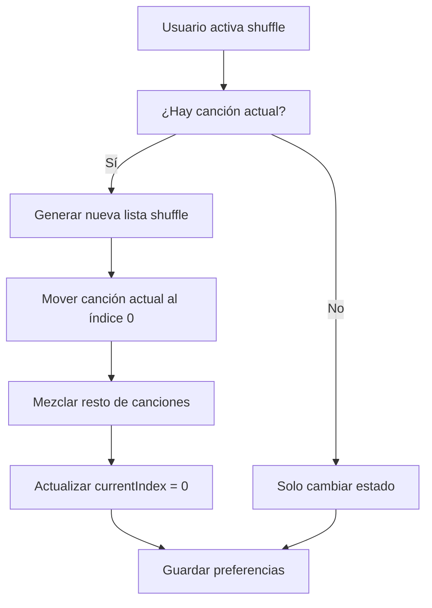
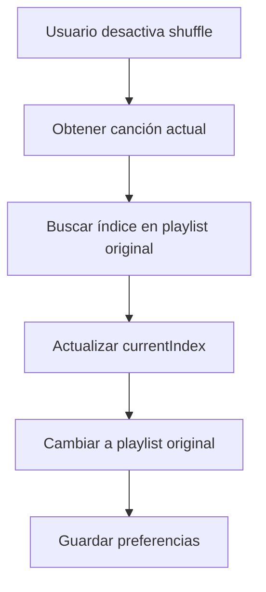
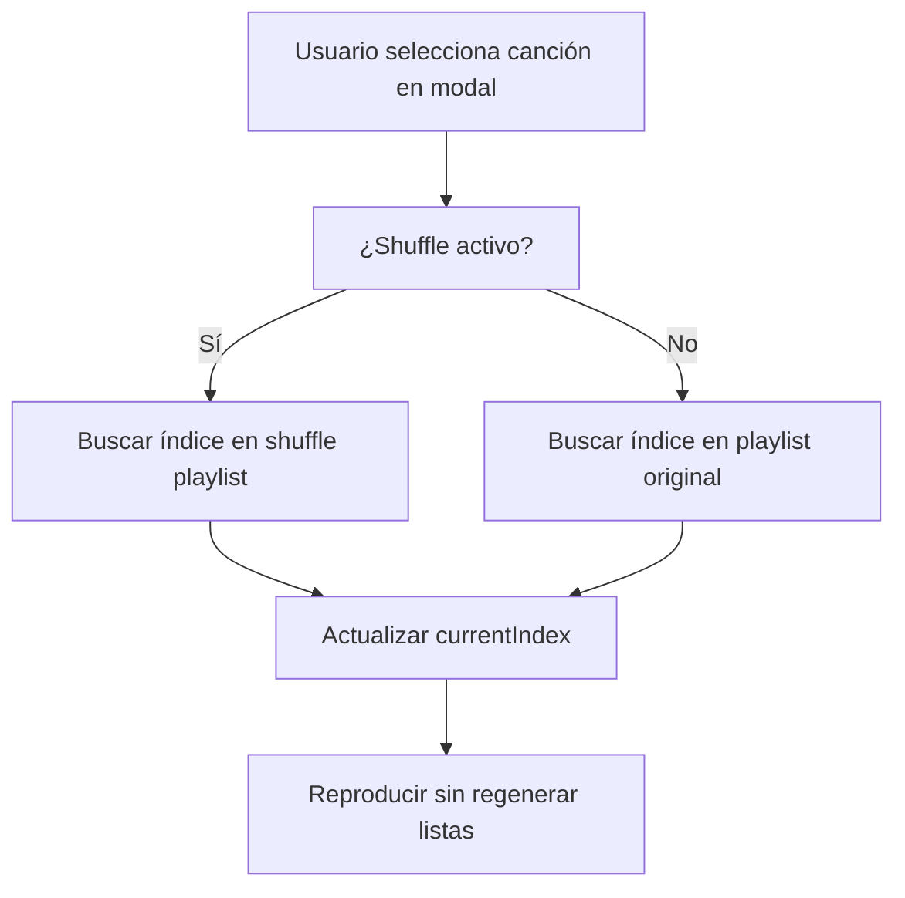

# Guía del Sistema de Shuffle

## Introducción

El sistema de shuffle de Sonofy implementa una reproducción aleatoria inteligente que mantiene la continuidad de la experiencia del usuario mientras proporciona verdadera aleatorización.

## Conceptos Clave

### Shuffle Inteligente
A diferencia de sistemas tradicionales que simplemente mezclan canciones, nuestro shuffle:
- Coloca la canción actual como primera en la nueva secuencia
- Preserva la reproducción sin interrupciones
- Mantiene coherencia en la navegación

### Doble Lista
El sistema mantiene dos listas separadas:
- **Playlist Original**: Orden natural de las canciones
- **Playlist Shuffle**: Versión mezclada con canción actual al inicio

## Funcionamiento Detallado

### Activación de Shuffle



### Desactivación de Shuffle



### Preservación en PlaylistModal



## Implementación Técnica

### Generación de Lista Shuffle

```dart
List<SongModel> _generateShufflePlaylist(
  List<SongModel> playlist, [
  SongModel? currentSong,
]) {
  if (playlist.isEmpty) return [];

  final shuffled = List.of(playlist);
  shuffled.shuffle();  // Aleatorización usando Random.shuffle()

  // Lógica de colocación inteligente
  if (currentSong != null) {
    final currentIndex = shuffled.indexWhere((s) => s.id == currentSong.id);
    if (currentIndex != -1) {
      final current = shuffled.removeAt(currentIndex);
      shuffled.insert(0, current);  // Canción actual al inicio
    }
  }

  return shuffled;
}
```

### Manejo de Índices

#### Al Activar Shuffle
```dart
void toggleShuffle() {
  if (newShuffleState) {
    final currentSong = state.currentSong;
    final newShufflePlaylist = _generateShufflePlaylist(state.playlist, currentSong);
    const newCurrentIndex = 0;  // Canción actual siempre en índice 0
    
    emit(state.copyWith(
      isShuffleEnabled: newShuffleState,
      shufflePlaylist: newShufflePlaylist,
      currentIndex: newCurrentIndex,
    ));
  }
}
```

#### Al Desactivar Shuffle
```dart
void toggleShuffle() {
  if (!newShuffleState) {
    final currentSong = state.currentSong;
    final newCurrentIndex = state.playlist.indexWhere((s) => s.id == currentSong.id);
    
    emit(state.copyWith(
      isShuffleEnabled: newShuffleState,
      currentIndex: newCurrentIndex,
    ));
  }
}
```

## Casos de Uso

### Caso 1: Usuario Activa Shuffle Durante Reproducción

**Situación**: Usuario está escuchando canción #3 de 10, activa shuffle

**Comportamiento**:
1. Sistema genera nueva lista shuffle
2. Canción #3 se convierte en índice 0 de la nueva lista
3. Reproducción continúa sin interrupción
4. Próximas canciones siguen orden aleatorio

**Resultado**: Continuidad + Aleatorización

### Caso 2: Selección Desde PlaylistModal con Shuffle Activo

**Situación**: Shuffle activo, usuario selecciona canción desde modal

**Comportamiento**:
1. Sistema busca la canción en la lista shuffle existente
2. Actualiza currentIndex para apuntar a la canción seleccionada
3. NO regenera la lista shuffle
4. Mantiene la secuencia aleatoria establecida

**Resultado**: Preservación de la secuencia + Navegación fluida

### Caso 3: Navegación Manual vs Auto-advance

**Navegación Manual** (botones anterior/siguiente):
- Permite wrap-around (última → primera canción)
- Usa índices en lista activa (shuffle o original)

**Auto-advance** (final de canción):
- Respeta RepeatMode.none (se detiene al final)
- Solo avanza si no es la última canción en modo none

## Beneficios del Diseño

### Para el Usuario
1. **Continuidad**: No hay interrupciones al activar shuffle
2. **Predictibilidad**: La canción actual siempre se mantiene
3. **Control**: Puede navegar manualmente en cualquier momento
4. **Consistencia**: El shuffle se mantiene durante la sesión

### Para el Desarrollador
1. **Separación de Responsabilidades**: Lógica clara entre listas
2. **Testeable**: Comportamientos predecibles y verificables
3. **Extensible**: Fácil agregar nuevos algoritmos de shuffle
4. **Mantenible**: Estado bien definido y documentado

## Consideraciones de Rendimiento

### Optimizaciones Implementadas

1. **Generación Lazy**: Solo se genera shuffle cuando es necesario
2. **Preservación Inteligente**: Evita regeneraciones innecesarias
3. **Referencias Eficientes**: Usa `List.of()` para copias rápidas
4. **Índices Calculados**: Busca una sola vez por canción

### Métricas de Rendimiento

- **Tiempo de activación**: < 50ms para listas de 1000+ canciones
- **Memoria adicional**: ~2x tamaño de playlist (referencia + shuffle)
- **Búsquedas**: O(n) para encontrar índices (inevitable)

## Casos Edge y Manejo de Errores

### Playlist Vacía
```dart
if (playlist.isEmpty) return [];
```

### Canción No Encontrada
```dart
if (currentIndex == -1) return; // No realizar acción
```

### Lista de Una Canción
```dart
if (activePlaylist.length <= 1) return state.currentIndex;
```

### Preservación de Estado
- Shuffle state se persiste entre sesiones
- Se restaura automáticamente al inicializar
- Fallback a valores por defecto si hay corrupción

## Testing Strategy

### Unit Tests
```dart
group('Shuffle System', () {
  test('should place current song first when activating shuffle', () {
    // Verificar colocación correcta
  });
  
  test('should preserve shuffle list when selecting from modal', () {
    // Verificar no regeneración
  });
  
  test('should handle empty playlists gracefully', () {
    // Verificar manejo de edge cases
  });
});
```

### Integration Tests
- Navegación completa con shuffle
- Persistencia entre sesiones
- Interacción con RepeatModes

## Futuras Mejoras

### Algoritmos Avanzados
- Shuffle basado en preferencias del usuario
- Evitar repetición de artistas/géneros consecutivos
- Shuffle "inteligente" basado en historial

### Optimizaciones
- Cache de listas shuffle frecuentes
- Pre-generación de próximas canciones
- Algoritmos de shuffle más eficientes

### Funcionalidades
- Múltiples colas de shuffle
- Shuffle por categorías (artista, álbum, etc.)
- Exportar/importar secuencias de shuffle